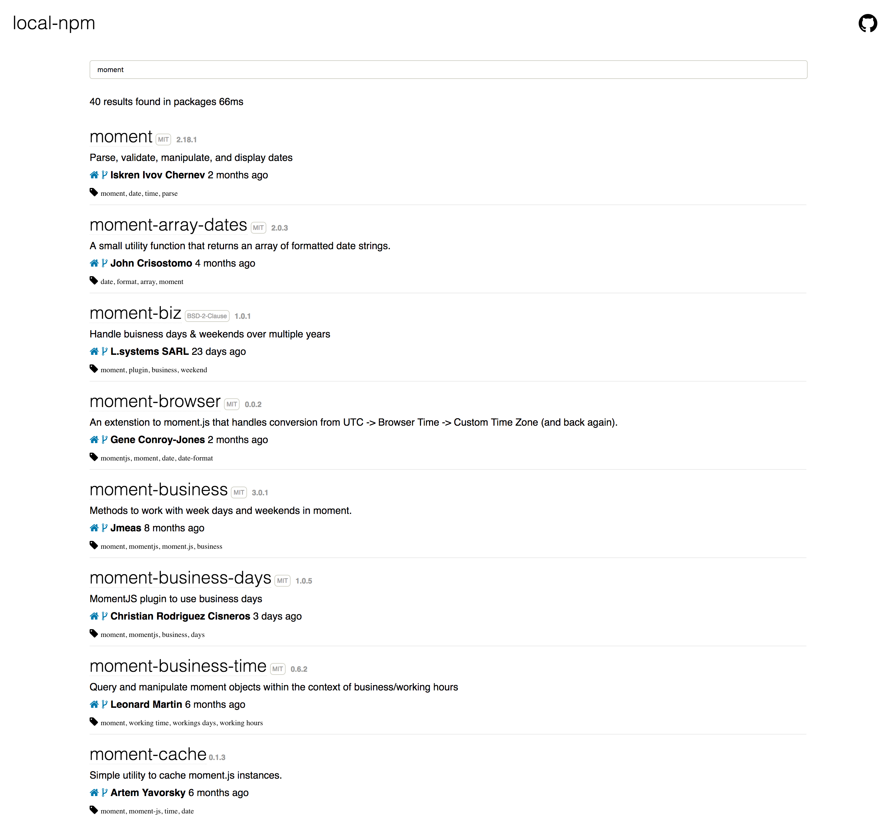
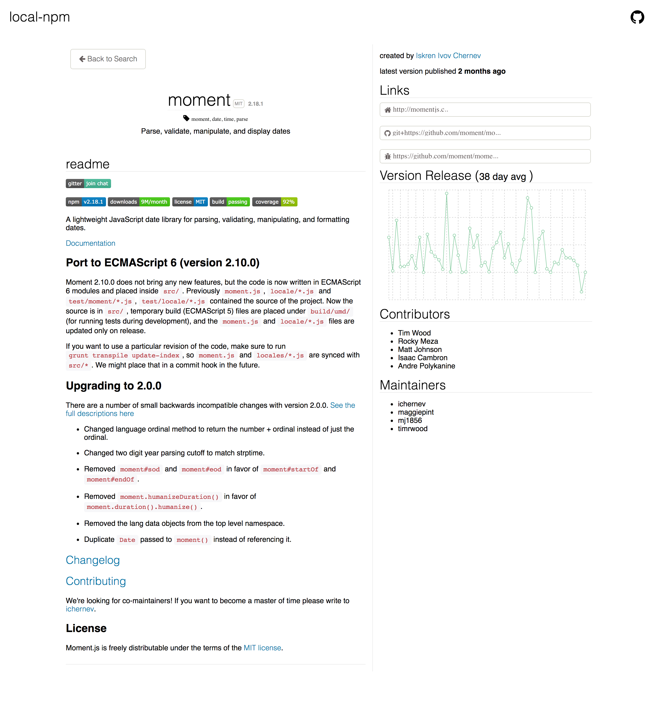

[](https://travis-ci.org/local-npm/local-npm) [](https://coveralls.io/github/local-npm/local-npm?branch=master)

`local-npm` is a Node server that acts as a local npm registry. It serves modules, caches them, and updates them whenever they change. Basically it's a local mirror, but without having to replicate the entire npm registry.

This allows your `npm install` commands to (mostly) work offline. Also, they get faster and faster over time, as commonly-installed modules are aggressively cached.

<!-- TOC depthFrom:1 depthTo:6 withLinks:1 updateOnSave:1 orderedList:0 -->

- [Introduction](#introduction)
- [Usage](#usage)
- [Command line options](#command-line-options)
- [Browser UI](#browser-ui)
- [Switching with npmrc](#switching-with-npmrc)
- [Speed test](#speed-test)
- [How it works](#how-it-works)

<!-- /TOC -->

# Introduction

`local-npm` acts as a proxy between you and the main npm registry. You run `npm install` commands like normal, but under the hood, all requests are sent through the local server.

When you first `npm install` a module, it'll be fetched from the main npm registry. After that, the module and all its dependencies (at that version) are stored in a local database, so you can expect subsequent installs to be much faster.

The server will also listen for changes from the remote registry, so you can expect updates to a module's metadata to be replicated within seconds of being published. (I.e. you won't get stuck with old versions.)

If you're organizing a conference/meetup/whatever, you can also share this local server with multiple people.  So if your teammates are constantly installing the same modules over and over again, this can save a lot of time in the long run.

`local-npm` is also a good way to make `npm install` work offline. Assuming new versions of a package haven't been published since you last installed, subsequent `npm install`s will all serve from the cache, without ever hitting a remote server.

Addy Osmani has [a nice post](https://addyosmani.com/blog/using-npm-offline/) comparing `local-npm` to other options.

# Usage

If you're using OS X, take a look at [local-npm-launch-agent](https://github.com/local-npm/local-npm-launch-agent), a one-liner that sets everything up automatically. Otherwise:

    $ npm install -g local-npm

Then

    $ local-npm

to start the server. (Note that it will write files in whatever directory you run it from.)

Then set `npm` to point to the local server:

    $ npm set registry http://127.0.0.1:5080

To switch back, you can do:

    $ npm set registry https://registry.npmjs.org

The same rules as for the [npm Australia mirror](http://www.npmjs.org.au/) apply here.

# Command line options

```
Usage: local-npm [options]

Options:

  -h, --help                   output usage information
  -V, --version                output the version number
  -p, --port [port]            The port to run local-npm on
  -pp, --pouch-port [port]     The port to run the pouch db server on
  -l, --loglevel [level]       The level to log information to the console from local-npm
  -r, --remote [url]           The registry to fallback information gathering and tars on
  -rs, --remote-skim [url]     The remote skimdb to sync couchdb information from
  -u, --url [url]              The default access url that local-npm will be hosted on
  -d, --directory [directory]  directory to store data
```

**Protip**: You can replicate from your friend's `local-npm` to your own `local-npm` by simply pointing at it:

```
$ local-npm \
   --remote http://<friends_hostname>:5080 \
   --remote-skim http://<friends_hostname>:16984/skimdb
```

While your friend does:

```
$ local-npm \
   --url http://<friends_hostname>:5080
```

In this way, you can create a daisy chain of awesome.

**Protip 2**: If you want to set up a single `local-npm` for multiple people to use, such as for conferences or workplaces, then just daemonize it (e.g. using [forever](https://www.npmjs.org/package/forever)), and then when you run it, specify the URL that clients will use to access the server, e.g.:

```
$ local-npm \
    --url http://192.168.x.x:5080
```

This will ensure that clients fetch tarballs from `192.168.x.x` instead of `127.0.0.1`.

If you want a GUI or don't want to run it from the command-line is an electron app for that! [https://github.com/local-npm/local-npm-daemon](https://github.com/local-npm/local-npm-daemon)


# Browser UI

A rudimentary npm-like UI that allows you to search modules and see their descriptions can be found at [http://localhost:5080/_browse](http://localhost:5080/_browse).

| main | package |
|------|---------|
|  |  |

If you haven't finished replicating the remote skimdb, then not all the modules will be visible yet.

# Switching with npmrc

Features like `npm search` are currently unsupported. So to avoid having to remember URLs when switching back and forth, you can use `npmrc` like so (based on the instructions for [the Australian mirror of npm](http://www.npmjs.org.au/)):


    $ npm install -g npmrc
    $ npmrc -c local
    $ npm set registry http://127.0.0.1:5080

then to search:

    $ npmrc default

and to switch back:

    $ npmrc local

Incidentally, though, `local-npm` does allow you to do `npm login` and `npm publish`. These commands will just be proxied to the main npm registry.

# Speed test

For a speed test of `local-npm` versus regular npm, [see these results](https://github.com/local-npm/test-local-npm-speed#readme).

# How it works

npm is built on top of CouchDB, so `local-npm` works by replicating the full "skimdb" database to a local [PouchDB Server](https://github.com/pouchdb/pouchdb-server). You can inspect the running database at [http://127.0.0.1:16984/_utils](http://127.0.0.1:16984/_utils). (Don't write to it!)

The entire "skimdb" (metadata) is replicated locally, but for the "fullfatdb" (metadata plus tarballs), only what you `npm install` is stored. To start from scratch, just delete whatever directory you started the server in.

CouchDB has a changes feed, so `local-npm` just listens to the `skimdb` changes to know when it needs to refresh an outdated module. Changes should replicate within a few seconds of being published. (You can watch this happen in realtime by reading the logs, which is kind of fun! An update comes in whenever someone publishes a module.)

Note that new tarballs aren't downloaded until you explicitly `npm install` them, though. So e.g. if you install `v1.0.0` of a package, then `v1.0.1` is published, and your range says `^1.0.0`, then the next `npm install` will fail unless you're online and can fetch the new tarball.
